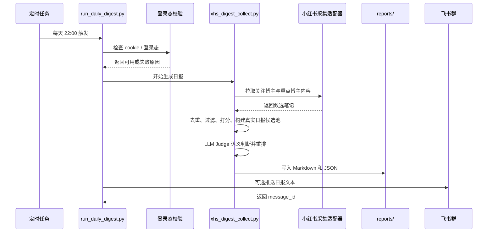

# XHS AI 日报助手

一个面向 AI 产品学习与行业热点追踪的本地化日报 Agent。项目围绕“小红书 AI 信息流过载、低质内容混入、人工筛选耗时”的问题，搭建了从内容采集、规则过滤、真实日报候选池构建、LLM Judge 语义判断到日报生成的自动化链路。

当前版本以 Python 为主实现，使用 Spider_XHS 作为小红书采集适配器，通过可维护的 YAML 规则集管理关注博主、重点博主、过滤规则、打分维度和日报输出策略；同时接入千问兼容接口作为 LLM Judge，在“当天优先、近 3 天补位、已发送去重”的真实候选池中做最终价值判断。飞书推送已支持，但当前试运行建议先只生成本地日报。

## 项目目标

- 自动跟踪用户已关注博主中与 AI 产品、AI 工具、Agent、AI PM 等主题相关的内容。
- 从候选内容中识别高价值信息，降低人工刷帖和整理日报的时间成本。
- 通过规则集、结构化特征和 LLM Judge，让“值得点开”的判断标准可解释、可调整。
- 支持每日定时生成日报，稳定后可选推送到飞书群，形成固定的信息入口。

## 核心能力

- 内容采集：基于用户关注博主和重点博主列表，采集小红书候选笔记。
- 结构化解析：提取标题、作者、正文、发布时间、互动信息、链接等字段。
- 规则过滤：过滤招聘、简历、强引流、泛教程、低相关内容等噪音。
- 价值判断：围绕主题相关性、信息增量、结论清晰度、工作帮助度等维度进行打分。
- 候选池控制：先筛出当天内容；不足时只补近 3 天且未发送过的内容。
- LLM Judge：对真实日报候选池做结构化语义判断，作为最终入选的重要依据。
- 去重控制：避免同一笔记或已推送内容重复进入日报。
- 自动推送：支持通过飞书开放平台将日报发送到指定群聊，当前可关闭。
- 登录态检查：运行前校验小红书登录态，避免 cookie 失效导致假空结果。

## 系统架构

```text
XHS AI 日报助手

定时触发 / 手动运行
    |
    v
【任务调度层】
run_daily_digest.py
    |
    v
【登录态校验层】
xhs_auth_refresh.py
    |
    |-- Cookie 失效 / 网络异常 --> 输出失败状态与处理建议
    |
    v
==================================================
                【内容采集层】
==================================================
关注博主 + 重点博主内容抓取
Spider_XHS / XHS API Adapter

    |
    v
==================================================
                【内容处理层】
==================================================
结构化解析：标题 / 作者 / 正文 / 时间 / 链接
候选池去重：按 note_id 合并重复内容
规则过滤：招聘 / 简历 / 引流 / 泛教程 / 弱相关内容

    |
    v
==================================================
                【Agent 判断层】
==================================================
特征抽取：主题相关性 / 信息增量 / 结论清晰度 / 工作帮助度
价值评分：规则权重 + 作者权重 + 新鲜度权重
真实日报候选池：当天优先，不足时仅补近 3 天且未发过内容
LLM Judge：对真实日报候选池做结构化语义判断
排序筛选：按 worth_click、规则分、作者权重输出最推荐 / 其余值得看

    |
    v
==================================================
                【输出与推送层】
==================================================
生成日报：Markdown + JSON
飞书推送：Feishu Message API（可选）
去重发送：同一天同内容不重复推送

    |
    v
本地查看日报 / 可选推送飞书
```

## 数据流



## 目录结构

当前开发目录结构如下：

```text
xhs-digest/
├── xhs_digest_collect.py          # 核心采集、过滤、打分、LLM Judge、日报生成逻辑
├── run_daily_digest.py            # 正式日报任务入口
├── send_feishu_digest.py          # 飞书消息推送
├── xhs_auth_refresh.py            # 小红书登录态检查与刷新
├── xhs_auth_common.py             # 网络错误 / 登录错误识别
├── xhs-digest-agent.rules.yaml    # Agent 外部规则包
├── xhs-digest-agent.knowledge.md  # 规则解释与知识文档
├── xhs-digest-agent.notes.md      # 项目设计笔记
├── LOCAL_AUTOMATION.md            # 本地自动化运行说明
├── RESUME_METRICS.md              # 项目指标口径说明
├── scripts/
│   ├── run_xhs_daily_local.sh     # 本地日报运行脚本
│   ├── install_xhs_launchd.sh     # 安装 launchd 定时任务
│   └── uninstall_xhs_launchd.sh   # 卸载 launchd 定时任务
├── launchd/
│   └── com.codex.xhs-digest.plist # macOS 定时任务配置模板
├── reports/                       # 日报输出与运行日志
└── Spider_XHS/                    # 第三方小红书采集适配器
```

> 如果上传 GitHub 时不希望包含第三方源码，可以不上传 `Spider_XHS/`，但需要在 README 中说明该目录为外部依赖，运行前需要自行接入。

## 核心实现说明

### 1. 外部规则包

项目没有把筛选标准全部写死在 prompt 或代码里，而是将规则沉淀到 `xhs-digest-agent.rules.yaml` 中，包括：

- 主题关键词：AI 产品、AI 工具、Agent、AI PM、AI 产品经理等，用于主题识别和标签推断。
- 重点博主：优先关注的账号列表。
- 排除关键词：招聘、简历、面经、卖课、私信、加群等。
- 排序策略：重点博主加权、主题命中加权、新鲜度权重、重复内容处理。
- Top Picks 标准：主题相关性、信息增量、结论清晰度、工作帮助度等。
- 输出格式：日报分区、单日数量上限、是否展示作者和链接。

这样做的好处是：后续调整日报偏好时，只需要改规则配置，不需要重写主流程代码。

### 2. 候选内容采集

当前正式日报只从用户已关注博主和重点博主范围内采集，不做全平台推荐。

- 重点博主：用户长期认可的信息源，会获得更高优先级。
- 普通关注博主：仍可进入日报，但需要内容本身足够有价值。

关键词不再作为当前版本的正式召回入口，主要用于主题识别、标签推断和后续调试。候选内容会按 `note_id` 去重，避免同一条笔记重复进入后续流程。

### 3. 过滤与噪音识别

过滤逻辑主要解决“信息流看起来很多，但真正值得看的很少”的问题。系统会根据标题、正文和标签识别以下噪音：

- 招聘、简历、秋招、面经等职业求职内容。
- 纯部署教程、泛编程教程、刷题内容。
- 卖课、训练营、私信、加群等强引流内容。
- 与 AI 产品学习、AI 工具观察、Agent 实践关系较弱的内容。

过滤不是简单删除所有教程，而是保留“有框架、有方法、有结论”的 AI 知识学习内容。

### 4. 价值判断与排序

候选内容会被转化为可评分特征，主要判断：

- 是否与 AI 产品、AI 工具、Agent、AI PM 等主题直接相关。
- 是否包含新产品、新功能、新观点、新信息源或新结论。
- 是否有明确结论，能不能快速判断“为什么值得看”。
- 是否对 AI 产品学习、工具选择、信息源跟踪或 PM 判断有帮助。
- 是否来自重点博主或关注博主。
- 是否与当天已选内容高度重复。

最终日报会分为“最推荐”和“其余值得看”。如果当天高质量内容不足，只允许补近 3 天内且未发送过的内容，避免日报反复出现旧内容。

### 5. LLM Judge 语义主裁判

当前版本支持 LLM Judge 层。它不是对全量抓取内容随便判断，而是在规则初筛之后，先构建“真正有资格进入日报”的候选池，再交给模型判断。

当前顺序是：

```text
抓取关注博主内容
  ↓
规则过滤与特征打分
  ↓
构建真实日报候选池：当天优先，不足时补近 3 天，且排除已发过内容
  ↓
LLM Judge 判断 worth_click、信息增量、清晰度、帮助度
  ↓
根据模型判断和规则分输出最终日报
```

LLM Judge 会输出：

- 是否值得点开
- 信息增量评分
- 结论清晰度评分
- 工作帮助度评分
- 一句话判断理由
- 一句话 takeaway

LLM Judge 主要补足规则系统对语义价值的理解不足。例如，用户反馈“每天切 8 个软件的活，终于被 AI 拯救了！”这类内容虽然不是新产品发布，也不是行业观点，但它体现了具体 AI 工具提效场景和工作流改造价值，因此应该被视为正向案例。

模型接口不可用时，系统会自动降级为原规则排序，不影响日报生成。

### 6. 日报生成

日报会同时输出两种文件：

- Markdown：用于阅读和飞书推送。
- JSON：用于调试、指标统计和后续分析。

默认输出目录为：

```text
reports/{date}.md
reports/{date}.json
```

### 7. 飞书推送

`send_feishu_digest.py` 通过飞书开放平台接口发送消息。配置来自 `feishu_app.env`：

```env
APP_ID=your_app_id
APP_SECRET=your_app_secret
RECEIVE_ID_TYPE=chat_id
RECEIVE_ID=your_chat_id
```

为避免重复发送，系统会将当天已发送的日报 hash 写入：

```text
reports/.feishu_sent.json
```

同一天同一份日报不会重复推送。

## 快速开始

### 1. 安装依赖

建议使用 Python 3.10+。

```bash
pip install pyyaml python-dotenv
```

如果需要完整采集能力，还需要按 `Spider_XHS` 项目要求安装其依赖。

### 2. 配置小红书 cookie

在 `Spider_XHS/.env` 中配置：

```env
COOKIES=your_xhs_cookie
```

检查登录态：

```bash
python3 xhs_auth_refresh.py --mode check
```

如果登录态失效，可以执行二维码登录刷新：

```bash
python3 xhs_auth_refresh.py --mode qr
```

### 3. 手动生成日报

```bash
set -a
source .env
set +a
XHS_SEND_FEISHU=0 python3 run_daily_digest.py
```

生成指定日期日报：

```bash
set -a
source .env
set +a
XHS_SEND_FEISHU=0 python3 run_daily_digest.py --date 2026-04-29
```

生成并推送到飞书：

```bash
python3 run_daily_digest.py --send-feishu
```

### 4. 本地定时运行

安装 macOS launchd 定时任务：

```bash
./scripts/install_xhs_launchd.sh
```

卸载定时任务：

```bash
./scripts/uninstall_xhs_launchd.sh
```

也可以直接运行本地脚本：

```bash
XHS_SEND_FEISHU=1 ./scripts/run_xhs_daily_local.sh
```

## 配置说明

主要配置文件是：

```text
xhs-digest-agent.rules.yaml
```

常见可调项：

- `sources.keywords`：调整主题识别和标签推断关键词。
- `sources.priority_authors`：调整重点博主。
- `sources.watch_authors`：调整普通关注博主。
- `sources.exclude_keywords`：调整硬过滤词。
- `ranking.daily_item_limit`：控制日报最多展示多少条。
- `ranking.top_pick_limit`：控制最推荐内容数量。
- `ranking.top_pick_scoring.thresholds`：控制 Top Picks 门槛。
- `llm_judge.enabled`：是否启用 LLM Judge 语义判断。
- `llm_judge.max_candidates`：每次交给模型判断的真实日报候选数量上限。

启用 LLM Judge 时，需要在项目根目录 `.env` 中配置 OpenAI-compatible 模型接口。当前默认按阿里百炼 / 千问兼容模式配置：

```env
QIANWEN_API_KEY=your_dashscope_api_key
QIANWEN_BASE_URL=https://dashscope.aliyuncs.com/compatible-mode/v1
QIANWEN_MODEL=qwen-plus
```

手动运行前需要加载 `.env`：

```bash
set -a
source .env
set +a
```

然后将 `xhs-digest-agent.rules.yaml` 中的配置改为：

```yaml
llm_judge:
  enabled: true
```

如果没有配置 API key，或模型接口失败，系统会自动回退到原规则排序，不会中断日报生成。

## 项目指标口径

项目中使用过的指标主要用于评估信息效率，而不是模型算法效果。

- 日报整理时间成本：根据初筛后候选内容量与最终日报内容量估算，当前样本中单次日报整理时间成本降低约 90%。
- 内容采纳率：最终进入日报的内容数 / 通过初筛的候选内容数。
- 任务完成率：定时任务成功生成日报或明确返回可处理状态的比例。

更详细的指标说明见：

```text
RESUME_METRICS.md
```

## 隐私与安全

上传 GitHub 前请不要提交以下文件：

```text
feishu_app.env
Spider_XHS/.env
reports/.feishu_sent.json
reports/logs/
*.log
__pycache__/
.DS_Store
```

原因：

- `feishu_app.env` 可能包含飞书 App Secret。
- `Spider_XHS/.env` 可能包含小红书 cookie。
- `reports/` 下的日志和状态文件可能包含本地路径、推送状态和个人使用数据。

如果需要展示日报效果，建议只保留脱敏后的样例日报。

## 当前限制

- 小红书没有官方开放接口，采集稳定性依赖登录态和第三方适配器。
- cookie 可能失效，需要定期刷新登录态。
- 当前已经接入 LLM Judge，但还没有建立完整的 badcase 评估集。
- 当前尚未接入 embedding + reranker，因此召回范围仍受关注博主更新限制。
- 飞书推送当前为文本消息，后续可以升级为卡片式摘要。

## 后续优化方向

- 在不破坏“只看关注博主”边界的前提下，接入 embedding 召回，补充语义相关但未显式命中关键词的内容。
- 引入 reranker，对候选内容进行更精细排序。
- 建立 LLM Judge badcase 标注和回放机制，用真实误判样本迭代 prompt 和规则。
- 将飞书文本推送升级为卡片式摘要。
- 将 cookie 刷新、异常重试和任务监控做成更完整的运行面板。

## 项目定位

这个项目不是简单的定时脚本，而是一个轻量级本地 Agent：

- 有目标：每天筛出值得看的 AI 信息。
- 有外部输入：用户关注博主和重点博主的小红书内容流。
- 有规则记忆：通过 YAML 和知识文档维护偏好。
- 有判断过程：过滤、打分、时间窗口控制、LLM Judge、排序、去重。
- 有行动输出：生成日报并推送到飞书。
- 有异常处理：登录态检查、网络错误识别、失败状态输出。

因此它更接近“面向个人信息效率场景的本地化 Agent”，而不是单纯的 workflow 自动化。
